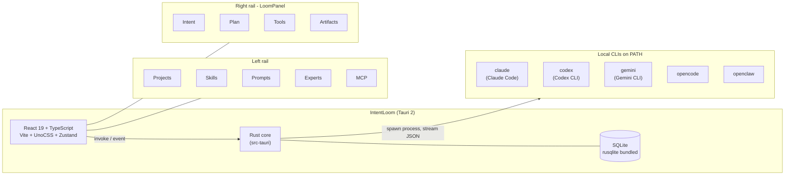

# IntentLoom

> [English](#) | [中文](./README.zh-CN.md)

**A local, multi-CLI AI coding cockpit — one chat box, many engines, every move on the loom.**


---

## TL;DR

> "I have a bunch of CLIs installed locally. I want to use them all in one place — a tab strip on top to switch between them, and a chat box underneath that just chats."

IntentLoom is a desktop app that gives you **one chat box, many local AI engines**. The top tab strip picks the engine — Claude Code, Codex, Gemini CLI, OpenCode, or OpenClaw — and the chat box underneath routes every message to whichever one is selected.

It is **not** an agent orchestrator, a model-comparison tool, or a relay framework. It is a switcher plus a chat box, and it tells the truth: the engine you see in the tab is the engine that actually runs your prompt.

---

## Why

Most "AI IDE" products try to be the model. IntentLoom is for people who already trust specific CLIs on their own machine and just want one place to talk to all of them.

Two things drove the design:

1. **Multi-CLI routing that doesn't lie.** Switching the top tab actually changes which binary runs your prompt. CLIs that are not on `PATH` are visibly marked as unavailable — no fake "connected" state.
2. **A chat box alone is not a product.** The welcome screen promises "weave the chaos of an idea into a clear product." A bare chat transcript does not deliver on that. The right side of the app is a permanent **Loom panel** that always shows: what you asked, what the AI is planning, which tools it is invoking, and what artifacts it has produced.

---

## Features

### Multi-CLI cockpit
- Tab strip across five local engines: **Claude Code**, **Codex**, **Gemini CLI**, **OpenCode**, **OpenClaw** (Hermes is wired but disabled until its backend lands)
- Each engine has a dedicated adapter that knows its verified CLI flags and how to normalize its stream-JSON output
- A sixth `Hermes` slot is reserved in the UI but greyed out — the backend commands are intentionally not registered yet, so the front-end throws instead of faking
- Engine availability is detected at startup via `which`; missing CLIs are visibly marked and refused on click

### Loom panel (always-on right rail)
Four sections, updated live as the conversation runs:

| Section | What it shows |
| --- | --- |
| **Intent** | The most recent user message, used as a fallback intent card until real intent parsing lands |
| **Plan** | The current plan entries the AI is working through |
| **Tools** | The last eight tool calls — edits render inline diffs, shell calls render the command monospace |
| **Artifacts** | Running tally of files added / modified / deleted and shell commands executed in this conversation |

### Workspace
- Project manager with per-project context
- Skills marketplace: search, install, update from GitHub repos, sub-directories, and ZIP URLs
- Local Skills browser (point at a folder containing `SKILL.md`)
- Prompts library, Experts directory, MCP server config

### System
- Per-engine model configuration
- Usage dashboard (per-conversation / per-engine)
- Live log panel and full audit report
- Command palette and keyboard shortcuts
- Dark / light theme
- Built-in auto-update via the Tauri updater plugin

### i18n
- `zh-CN` and `en-US` are first-class
- All product strings live in `src/i18n.ts`; the rest of the app is i18n-driven

---

## Architecture



The five CLI adapters live in `src-tauri/src/agents/{claude,codex,gemini,opencode,openclaw}.rs`. Each one owns:

- the **verified** command-line flags (cross-checked against `--help` on a real install, not invented),
- a `build_stream_command` that builds the argv,
- a Rust unit test that pins the expected argv so a flag rename upstream breaks the build.

Stream chunks are normalized at the front-end boundary in `src/lib/streamChunkParser.ts` into a shared `AgentEvent` contract, so the rest of the UI does not care which engine produced them.

---

## Tech stack

| Layer | Choice |
| --- | --- |
| Shell | Tauri 2 (Rust) |
| UI | React 19 + TypeScript 5.7 |
| Build | Vite 6 |
| Styling | UnoCSS (atomic, Tailwind-compatible) |
| State | Zustand 5 |
| Editor | Monaco (`@monaco-editor/react`) |
| Icons | `lucide-react` |
| Routing | `react-router-dom` 6 |
| Persistence | SQLite via `rusqlite` (bundled) |
| Updates | `@tauri-apps/plugin-updater` |
| Test | Vitest 2 + Testing Library + jsdom (front-end), `cargo test` (back-end) |

---

## Getting started

### Prerequisites

- **Node.js** 18+ (Vite 6 wants a modern Node)
- **Rust** stable + `cargo` (Tauri 2 prerequisites — see <https://tauri.app/start/prerequisites/>)
- **Platform deps** for Tauri 2 (WebView2 on Windows, webkit2gtk on Linux, Xcode CLT on macOS)
- **At least one local CLI** on `PATH` if you want the chat to actually go somewhere — `claude`, `codex`, `gemini`, `opencode`, or `openclaw`. Missing CLIs show up as unavailable in the tab strip; the app still launches.

### Install

```bash
npm install
```

### Run in dev

```bash
npm run tauri dev
```

This boots Vite on `http://localhost:5173` and launches the Tauri shell pointed at it. Hot reload works on the front-end; Rust changes trigger a rebuild.

### Build a release

```bash
npm run build        # vite build -> dist/
npm run tauri build  # bundle the desktop app
```

`deploy.sh` wraps both: `npm run build && npm run tauri build`.

### Run the tests

```bash
npm test            # vitest - front-end unit tests (jsdom)
npm run typecheck   # tsc --noEmit
cargo test --manifest-path src-tauri/Cargo.toml
```

---

## Project structure

```
.
|-- src/                        # React front-end
|   |-- App.tsx
|   |-- ReasonixApp.tsx         # main shell, 3-column layout, CLI tab strip
|   |-- i18n.ts                 # zh-CN + en-US message tables
|   |-- components/
|   |   |-- Chat/               # composer + transcript + tool cards (with diff)
|   |   |-- Loom/               # LoomPanel + ConversationSummary
|   |   |-- LeftPanel/          # projects / skills / prompts / experts / mcp / usage / logs
|   |   |-- layout/             # status bar, drawers, tools modal
|   |   '-- common/             # command palette, toast container
|   |-- lib/                    # adapters, parsers, Tauri bridge, hooks
|   |-- stores/                 # Zustand stores
|   |-- test/                   # vitest setup + unit tests
|   |-- styles/                 # global CSS (incl. .loom-panel* and diff styles)
|   '-- types/                  # shared TS types
|-- src-tauri/                  # Rust back-end
|   '-- src/
|       |-- agents/             # one adapter per CLI + the registry
|       |-- commands/           # invoke handlers (ai, agents, db, ...)
|       |-- db/                 # SQLite schema + migrations
|       |-- utils/
|       |-- lib.rs              # plugin registration, command surface
|       '-- main.rs
|-- docs/
|   |-- plan/                   # current roadmap (W1-W3 shipped, see below)
|   |-- planning/               # older ADJUSTMENT_PLAN
|   |-- reviews/                # full-audit-report-2026-06-04
|   '-- references/             # source material
|-- deploy.sh                   # build + bundle in one shot
|-- uno.config.ts
|-- vite.config.ts
'-- tsconfig.json
```

---

## Status

The two-roadmap plan in [`docs/plan/`](./docs/plan/README.md) is largely shipped on `main`:

- **Multi-agent cockpit** (W1-W3): hardcoded `cli: "claude"` removed, five adapters live and unit-tested, stream JSON normalized at the front-end, `Conversation` is bound to its engine, missing CLIs are honestly marked, `Hermes` UI is disabled instead of faking.
- **Loom as product** (W1-W3): 3-column layout, right-rail LoomPanel, tool cards render real diffs, artifact tally shared between the live panel and the conversation summary card.

Type-check, Vite build, and `cargo test --lib` all pass cleanly. The next push is W4 polish and on-device validation with real users — see [`docs/plan/`](./docs/plan/README.md) for the full breakdown.

---

## Documentation

- [`docs/plan/README.md`](./docs/plan/README.md) — current two-axis roadmap, what shipped and what's next
- [`docs/plan/multi-agent-cockpit.md`](./docs/plan/multi-agent-cockpit.md) — the multi-CLI routing plan in depth
- [`docs/plan/the-loom-as-product.md`](./docs/plan/the-loom-as-product.md) — the Loom panel design rationale
- [`docs/planning/ADJUSTMENT_PLAN.md`](./docs/planning/ADJUSTMENT_PLAN.md) — broader cross-stack adjustment plan (P0/P1)
- [`docs/reviews/full-audit-report-2026-06-04.md`](./docs/reviews/full-audit-report-2026-06-04.md) — the full-stack audit that seeded both plans

---

## Contributing

Issues and PRs are welcome. A few things that will save everyone time:

- One PR per change, scoped tightly.
- Touch the matching test when you touch an adapter, a parser, or a store. The `vitest` suite and the per-adapter `cargo test` are the only thing standing between a refactor and silent regression.
- If you change a CLI's flags, run it on a real install with `--help` first and update the adapter test in the same commit.
- Keep the Loom metaphor honest: the welcome screen promises "weave"; the product should keep earning that promise.

---

## License

Not yet chosen. Until a `LICENSE` file lands, treat this as "all rights reserved" by the author.

---

## Acknowledgments

IntentLoom stands on the shoulders of the five CLIs it routes to — Claude Code, Codex, Gemini CLI, OpenCode, and OpenClaw. Without them, there would be nothing to switch between.
