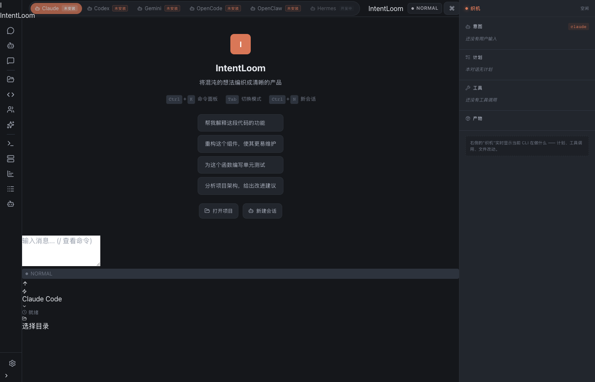
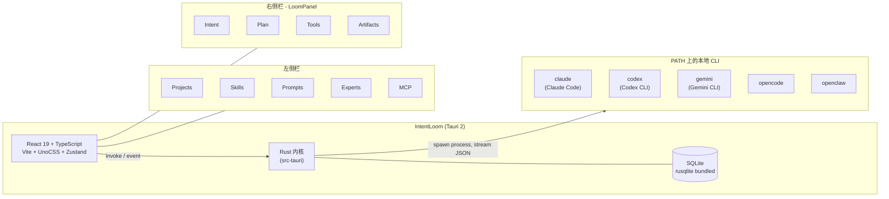

# IntentLoom

> [English](./README.md) | [中文](#)

**本地的多 CLI AI 编码驾驶舱 —— 一个聊天框,多套引擎,每一动作都织在 Loom 上。**



---

## TL;DR

> "我本地装了很多 CLI,我可以在一个平台里统一使用这些,比如顶部可以切换这些平台,切换之后,聊天框里就可以直接聊天了。"

IntentLoom 是一个桌面应用,给你 **一个聊天框 + 多套本地 AI 引擎**。顶部 tab 选中哪个引擎 —— Claude Code、Codex、Gemini CLI、OpenCode、OpenClaw —— 下面的聊天框就把每条消息送到那一个去。

它 **不是** 多 Agent 编排器,不是模型对比工具,也不是接力框架。它就是一个切换器 + 一个聊天框,而且 **不撒谎**:tab 上写的引擎,就是真正跑你 prompt 的那个。

---

## 为什么做这个

大多数 "AI IDE" 都想自己当模型。IntentLoom 服务的,是那些已经在本地装好、信任自己用惯的 CLI,只想找一个统一入口去和它们对话的人。

两个判断驱动了产品形态:

1. **多 CLI 路由,不能骗人。** 顶部切 tab 真的会把消息送到对应的二进制。某个 CLI 不在 `PATH` 上,就在 UI 上明确标"未安装"——不假装"已连接"。
2. **单一个聊天框不构成产品。** 欢迎页写着"将混沌的想法编织成清晰的产品",一个裸的 chat transcript 兑现不了这句话。所以应用右侧常驻一个 **Loom 面板**,始终在显示:你问了什么、AI 在计划什么、调了哪些工具、做出了什么产物。

---

## 功能

### 多 CLI 驾驶舱
- 顶部 tab 覆盖 5 个本地引擎:**Claude Code**、**Codex**、**Gemini CLI**、**OpenCode**、**OpenClaw**(Hermes 槽位已留好,后端落地前灰着)
- 每个引擎一份独立 adapter,记录它被验证过的 CLI flag 以及如何归一化它的 stream-JSON
- 第六个 `Hermes` 槽位在 UI 里保留但灰显 —— 后端命令故意不注册,前端在调用时直接 throw,避免画饼
- 启动时用 `which` 探测可用性;缺失的 CLI 在 tab 上明显标出,点击直接拒绝并提示

### Loom 面板(常驻右侧栏)
四段,对话进行时实时更新:

| 段 | 展示内容 |
| --- | --- |
| **意图(Intent)** | 取最近一条 user message 作为兜底意图卡,等真实意图解析落地后替换 |
| **计划(Plan)** | AI 当前正在推进的 plan 条目 |
| **工具(Tools)** | 最近 8 条 tool call —— 编辑类内联 diff,shell 类以 monospace 块显示命令 |
| **产物(Artifacts)** | 本对话累计的 added / modified / deleted 文件数,以及执行过的命令数 |

### 工作区
- 项目管理,带 per-project 上下文
- Skills 商店:支持从 GitHub 仓库、子目录、ZIP URL 搜索/安装/更新
- 本地 Skills 浏览器(指向包含 `SKILL.md` 的文件夹)
- Prompts 库、Experts 目录、MCP 服务器配置

### 系统
- 各引擎独立的模型配置
- 用量统计(per-conversation / per-engine)
- 实时日志面板 + 完整审计报告
- Command palette + 键盘快捷键
- 深色 / 浅色主题
- 通过 Tauri updater 插件内置自动更新

### 国际化
- `zh-CN` 与 `en-US` 一等公民
- 所有产品文案集中在 `src/i18n.ts`;UI 全部走 i18n

---

## 架构



5 个 CLI adapter 落在 `src-tauri/src/agents/{claude,codex,gemini,opencode,openclaw}.rs`,每个 adapter 自带三件事:

- **已验证**的 CLI flag(在真实安装上跑 `--help` 核对,不是脑补的);
- 一个 `build_stream_command` 用来构造 argv;
- 一个 Rust 单元测试,把"期望的 argv"钉死 —— 上游一旦改名,构建会断。

stream chunk 在前端边界 `src/lib/streamChunkParser.ts` 归一化成共享的 `AgentEvent` 契约,UI 层不再关心是哪个引擎吐出来的。

---

## 技术栈

| 层 | 选型 |
| --- | --- |
| 外壳 | Tauri 2 (Rust) |
| UI | React 19 + TypeScript 5.7 |
| 构建 | Vite 6 |
| 样式 | UnoCSS(原子化,兼容 Tailwind) |
| 状态 | Zustand 5 |
| 编辑器 | Monaco(`@monaco-editor/react`) |
| 图标 | `lucide-react` |
| 路由 | `react-router-dom` 6 |
| 持久化 | SQLite via `rusqlite`(bundled) |
| 更新 | `@tauri-apps/plugin-updater` |
| 测试 | Vitest 2 + Testing Library + jsdom(前端)、`cargo test`(后端) |

---

## 快速开始

### 前置依赖

- **Node.js** 18+(Vite 6 要求较新的 Node)
- **Rust** stable + `cargo`(Tauri 2 前置依赖 —— 见 <https://tauri.app/start/prerequisites/>)
- **平台依赖**:Windows 上的 WebView2、Linux 上的 webkit2gtk、macOS 上的 Xcode CLT
- **至少一个本地 CLI** 在 `PATH` 上,聊天才能真的跑通 —— `claude`、`codex`、`gemini`、`opencode`、`openclaw` 任意一个即可。缺失的 CLI 会在 tab 上标"未安装",应用本身仍能正常启动

### 安装

```bash
npm install
```

### 开发模式运行

```bash
npm run tauri dev
```

会启动 Vite(`http://localhost:5173`)并拉起指向它的 Tauri 外壳。前端热更新;Rust 改动会触发重编。

### 打 release 包

```bash
npm run build        # vite build -> dist/
npm run tauri build  # 打包桌面应用
```

`deploy.sh` 把两步串起来:`npm run build && npm run tauri build`。

### 跑测试

```bash
npm test            # vitest - 前端单元测试(jsdom)
npm run typecheck   # tsc --noEmit
cargo test --manifest-path src-tauri/Cargo.toml
```

---

## 目录结构

```
.
|-- src/                        # React 前端
|   |-- App.tsx
|   |-- ReasonixApp.tsx         # 主外壳,3 列布局,CLI tab 栏
|   |-- i18n.ts                 # zh-CN + en-US 文案表
|   |-- components/
|   |   |-- Chat/               # composer + transcript + tool cards(含 diff)
|   |   |-- Loom/               # LoomPanel + ConversationSummary
|   |   |-- LeftPanel/          # projects / skills / prompts / experts / mcp / usage / logs
|   |   |-- layout/             # status bar, drawers, tools modal
|   |   '-- common/             # command palette, toast container
|   |-- lib/                    # adapters、parsers、Tauri 桥、hooks
|   |-- stores/                 # Zustand stores
|   |-- test/                   # vitest setup + 单元测试
|   |-- styles/                 # 全局 CSS(含 .loom-panel* 与 diff 样式)
|   '-- types/                  # 共享 TS 类型
|-- src-tauri/                  # Rust 后端
|   '-- src/
|       |-- agents/             # 每个 CLI 一份 adapter + 注册表
|       |-- commands/           # invoke 处理(ai, agents, db, ...)
|       |-- db/                 # SQLite schema + migrations
|       |-- utils/
|       |-- lib.rs              # 插件注册,command 出口
|       '-- main.rs
|-- docs/
|   |-- plan/                   # 当前双轴路线图(W1-W3 已落地,见下)
|   |-- planning/               # 较老的 ADJUSTMENT_PLAN
|   |-- reviews/                # full-audit-report-2026-06-04
|   '-- references/             # 原材料
|-- deploy.sh                   # build + bundle 一把梭
|-- uno.config.ts
|-- vite.config.ts
'-- tsconfig.json
```

---

## 当前状态

[`docs/plan/`](./docs/plan/README.md) 里描述的两条主线,在 `main` 分支上大部分已经落地:

- **多 Agent 驾驶舱**(W1-W3):移除硬编码的 `cli: "claude"`;5 个 adapter 全部建立并带单测;stream JSON 在前端归一化;`Conversation` 与引擎绑定;未安装 CLI 如实标记;`Hermes` 在 UI 上灰显而不是假装可用。
- **Loom 作为产品形态**(W1-W3):3 列布局;右侧 LoomPanel 常驻;ToolCard 渲染真实 diff;live panel 与对话产物卡片共用同一份 artifact 累计。

`typecheck`、Vite build、`cargo test --lib` 全部干净通过。下一阶段是 W4 的打磨与真实用户上机验证 —— 详细分解见 [`docs/plan/`](./docs/plan/README.md)。

---

## 文档

- [`docs/plan/README.md`](./docs/plan/README.md) —— 当前双轴路线图,以及已落地 / 待办清单
- [`docs/plan/multi-agent-cockpit.md`](./docs/plan/multi-agent-cockpit.md) —— 多 CLI 路由方案的深度展开
- [`docs/plan/the-loom-as-product.md`](./docs/plan/the-loom-as-product.md) —— Loom 面板的设计理念
- [`docs/planning/ADJUSTMENT_PLAN.md`](./docs/planning/ADJUSTMENT_PLAN.md) —— 跨栈调整方案,范围更广(P0/P1)
- [`docs/reviews/full-audit-report-2026-06-04.md`](./docs/reviews/full-audit-report-2026-06-04.md) —— 催生这两份方案的全栈审计报告

---

## 参与贡献

欢迎提 Issue / PR。几条能让大家少返工的建议:

- 一个 PR 一件事,范围收得越紧越好
- 动 adapter / parser / store 时,顺手把对应的测试改了 —— `vitest` 套件和每个 adapter 的 `cargo test` 是 refactor 与静默回归之间唯一的护栏
- 改某个 CLI 的 flag 前,先在真实安装上跑 `--help` 核对,并在同一个 commit 里更新 adapter 测试
- 让 Loom 这个隐喻保持诚实:欢迎页承诺"编织",产品要持续兑现它

---

## 协议

尚未选定。在 `LICENSE` 文件落地之前,默认视为作者保留所有权利。

---

## 致谢

IntentLoom 站在它所路由的 5 个 CLI 肩上 —— Claude Code、Codex、Gemini CLI、OpenCode、OpenClaw。没有它们,也就没有可切换的对象。
